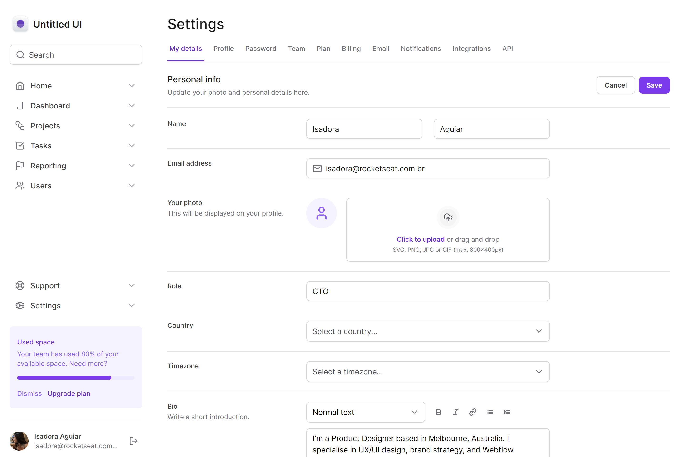

<h1 align="center"> Dashboard Next </h1>

<p align="center">
Essa aplicação foi desenvolvida durante o curso de TailwindCSS da Rocketseat. <br/>
</p>

<p align="center">
  
</p>

<p align="center">
  
</p>

 <h3 align="center"><a href="https://dashboard-next-ui-two.vercel.app/" target="_blank">Projeto ao vivo</a></h3>


### 💻 Executando

Após clonar o repositório, acesse a pasta do projeto e execute os comandos abaixo:

```sh
npm install
npm run dev
```

Acesse http://localhost:3000 para visualizar a aplicação.

### :memo: Licença

Esse projeto está sob a licença MIT.

---

Feito com ♥ by Isadora Aguiar :wave:
